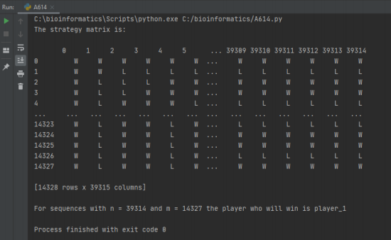
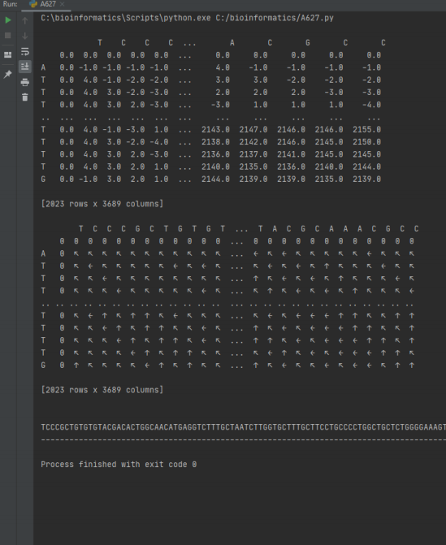
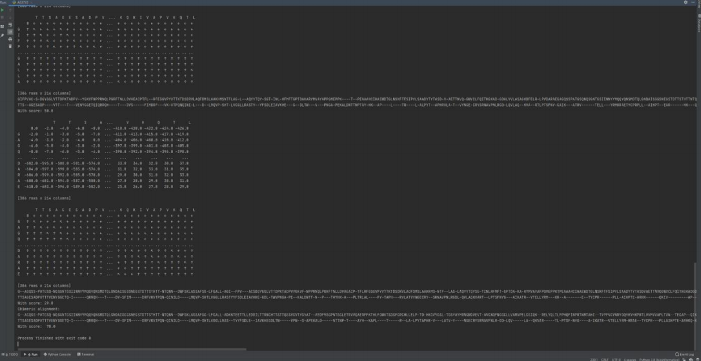
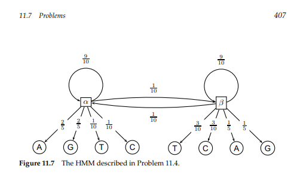
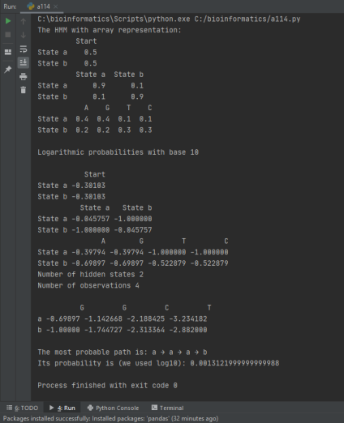

A614.py - 
Two players play the following game with two sequences of length n and m nucleotides. At every turn a player must delete two nucleotides from one sequence
(either the first or the second) and one nucleotide from the other. The player who
cannot move loses. Who will win? Describe the winning strategy for each n and 

A622.py -
Give an algorithm which computes the optimal overlap alignment, and runs in time
O(nm).
Suppose that we have sequences v = v1 . . . vn and w = w1 . . . wm, where v is longer than w.
We wish to find a substring of v which best matches all of w. Global alignment won’t work
because it would try to align all of v. Local alignment won’t work because it may not align all
of w. Therefore this is a distinct problem which we call the Fitting problem. Fitting a sequence
w into a sequence v is a problem of finding a substring v
0 of v that maximizes the score of
alignment s(v0, w) among all substrings of v.

A637.py - 
Devise an efficient algorithm for the chimeric alignment problem.
In the chimeric alignment problem, a string v and a set of strings {w1, . . . , wN } are given, and
the problem is to find max1≤i,j≤N s(v, wi ◦ wj ) where wi ◦ wj is the concatenation of wi and
wj (s(·, ·) stand for the score of optimal global alignment).

A114.py -
Figure 11.7 shows an HMM with two states α and β. When in the α state, it is more
likely to emit purines (A and G). When in the β state, it is more likely to emit pyrimidines (C and T). Decode the most likely sequence of states (α/β) for sequence GGCT.
Use log-scores, rather than straight probability scores.

